# TENSUM: Two-dimensional entropy stable unstructred mesh solver

### Created by: Deep Ray, TIFR-CAM, Bangalore 

### Webpage: deepray.github.io 

### Date : 30 October, 2015

**TENSUM** is a parallelized finite volume solver for compressible flows on unstructured triangular grids. It is based on the [TAXIS](https://github.com/cpraveen/taxis) solver developed by [Praveen Chandrashekar](http://cpraveen.github.io/). Details about the discretiziation and implementation of the various numerical schemes can be found in

1. ["Entropy stable schemes on two-dimensional unstructured grids for Euler equations"](http://dx.doi.org/10.4208/cicp.scpde14.43s), by D. Ray, P. Chandrashekar, U. Fjordholm and S. Mishra; Communications in Computational Physics, Vol. 19(5), pp. 1111-1140 (2016). 
2. ["An entropy stable finite volume scheme for the two dimensional Navier–Stokes equations on triangular grids"](http://www.sciencedirect.com/science/article/pii/S009630031730471X), by D. Ray, P. Chandrashekar; Applied Mathematics and Computation, Vol. 314, pp. 257-286 (2017).
3. ["Entropy-stable finite difference and finite volume schemes for compressible flows"](http://deepray.github.io/thesis.pdf), doctoral thesis by D. Ray, 2017.

**NOTE:** If the math symbols do not display properly in README.md. have a look at README.pdf instead.

## Table of contents
<ul>
<li><a href="#compiling">Compiling the code</a></li>
<li><a href="#usage">Using the code</a></li>
<li><a href="#inputparam">Parameter file for python wrapper</a></li>
<li><a href="#partf">Partitioned file format</a></li>
<li><a href="#param">Parameter file for main solver</a></li>
<li><a href="#examples">Examples</a></li>
   <ul>
   <li><a href="#1dsod">One-dimensional shocktube problem</a></li>
   <li><a href="#isenvort">Isentropic vortex</a></li>
   <li><a href="#naca">Transonic flow past NACA-0012 airfoil</a></li>
   <li><a href="#rae">Transonic flow past RAE-2822 airfoil</a></li>
   <li><a href="#step">Flow past a forward step</a></li>
   <li><a href="#flatplate">Laminar flat-plate boundary layer</a></li>
   <li><a href="#uqsod">UQ with the shocktube problem</a></li>
   <li><a href="#other_tests">Other available test cases</a></li>
   </ul>
</ul>

## Compiling the code 
After cloning the git repository into your local system, you need to set the following paths/variables in your .bashrc file

~~~sh
export TENSUM_HOME=<path to TENSUM directory>
PATH=$PATH:$TENSUM_HOME/py_wrap
PATH=$PATH:$TENSUM_HOME/grid_gen
PATH=$PATH:$TENSUM_HOME/src
~~~

The following primary exectuable files need to be generated:

1. `grid_part` in the directory grid_gen. This is used to read the mesh file and create paritioned mesh components, which are required by the main solver. 
2. `tensum` in the directory src. This executes the main finite volume solver.

To generate the above executables at once, use the `make` command from the TENSUM home folder. Alternatively, you can go to the individual sub-directories and use `make`. To clear the executables and object files, use `make clean`.   

The unstructured meshes are generated using [Gmsh](http://gmsh.info/), which is an open-source finite element grid generator with a built-in CAD engine, and equipped with several important post-processing tools. You need to install Gmsh and ensure that you are able to access gmsh from the terminal window. In other word

~~~sh
$ gmsh
~~~

should start the Gmsh console. 

 <a href="#TOC" >back to table of contents</a>  

## Using the code 
If the various paths have been correctly added to the .bashrc file, then the solver can be used from anywhere in the system. Some important test cases have given in the **examples** sub-directory. It is recommended that all future test cases be run from the examples folder. 

To run a particular problem, two parameter files are required. The first one is called `input.param` by default, and is needed by the python wrapper that initiates different parts of the code. The second parameter file is called `param.in` by default, and is needed by the executable `tensum`.

To run the code, go to the folder containing the `input.param` file and run

~~~sh
tensum_run.py input.param
~~~

 <a href="#TOC" >back to table of contents</a>  

## Description of `input.param`
The basic structure of the python parameter file is as follows:

~~~text
# Basic paths/parameters
mesh_file_name    = mymesh.geo
mesh_parts        = 2
mesh_dimension    = 2
partition_dir_loc = .
solver_param_file = param.in

# Flags for main operations
gen_mesh_and_part = yes
initiate_solver   = no

# Flags for solver
use_solver        = yes
read_from_restart = no 
print_cells       = yes
print_bounds      = no
verbose           = yes

# Number of processors to be used in the solver.
nprocs            = 2 
~~~

**WARNING!!** Do not use TABS in this parameter file, or else the python wrapper will not be able to read it correctly.
 
* `mesh_file_name` specifies the Gmsh geometry file that is used to generate the mesh. Currently, `grid_part` is only capable of handling Gmsh files. Furthermore, one can either specify the gmsh geometry file (with the file extension .geo) or the mesh file (with the file extension .msh)
* `mesh_parts` specifies the number of partitions partitions the mesh is broken into.  
* `mesh_dimension` species the spatial dimension of the mesh. This must always be set to be `2`. 
* `partition_dir_loc` specifies the path (relative to `input.param`) where the folder **PARTITION** containing the partitioned mesh files will be created, or is available. In the above example, the value `.` signifies that PARTITION is created/available in the same directory as the parameter file.
* `solver_param_file` specifies the name and location (relative to `input.param`) of the parameter file needed by `tensum`. In the above example, the file is name `param.in` and is located in the same folder.
* The mesh is generated and partitioned using the executable `grid_part` if `gen_mesh_and_part` is set to `yes`. The partitioned data is saved in the folder PARTITION. If this is not desired, then this flag must be set to `no`.
* The main solver is run, i.e., the executable `tensum`, if `intiate_solver` is set to `yes`. If this is not desired, then this flag must be set to `no`. The solver needs the specification of a few additional flags:
 * If `use_solver` is set to `no`, only the pre-processor part of the solver is run. This includes reading the partitioned mesh data in PARTITION, and creating the various grid data structures needed by the solver. This flag should be used to check whether the mesh has been correctly partitioned, and to print out the primal and dual grids (if the `print_cells` flag is switched on). Set `use_solver` to `yes` to run the full solver.
 * If `read_from_restart` is set to `yes`, then the solver recovers the solution from a set of restart files (if available). This is useful if the simulation was stopped abruptly, and can be resumed from the last set of restart files saved. If no restart file is available, then the solver starts from scratch.
 * If `print_cells` is set to `yes`, then the primal and dual grids are saved in a file, which can be visualized using an additional scripts. 
 * If `print_bounds` is set to `yes`, then the solution bounds at each time step is saved in the file **bounds.dat**.
 * If `verbose` is set to `yes`, then addition solver data will be printed on screen. This flag is useful for debugging purposes.
 * The number of processors to be used by the solver is set using `nprocs`. **NOTE:** This must be a positive multiple of `mesh_parts`.

 <a href="#TOC" >back to table of contents</a>  

## Partitioned file format
An important tool implemented inside Gmsh is METIS, which is a package used for graph partitioning. We use the information provided by METIS to partition the mesh based on the cell-graph. As an example, the mesh around a NACA-0012 airfoil is partitioned into 10 sub-meshes, as shown in Figure 1, with each partition depicted by a different colour. 

<figure>
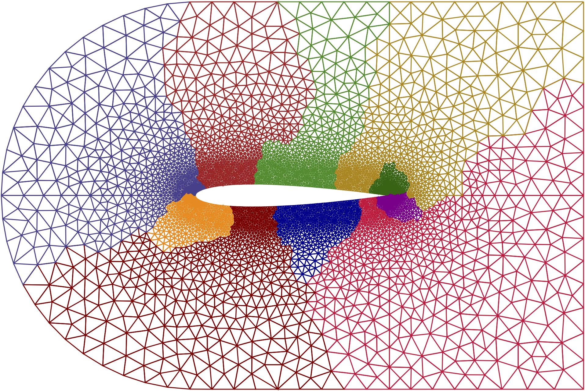
<figcaption>Fig. 1: Paritioned NACA-0012 mesh</figcaption>
</figure>

The partitioning algorithm should ensure

1. Each sub-mesh has approximately the same number of cells, which is also termed as load balancing.
2. The amount of communication between processors is minimum, which depends on the length of the boundary between sub-meshes and the number of neighbouring sub-meshes. 

The TENSUM solver can read in a Gmsh mesh file, and partition it into `mesh_parts` number of sub-mesh files, which is stored in the PARTITION folder. The cells and vertices part of a given partition are termed as **active elements**. In addition, each partition file also contains information about those cells with at least one (but not all) vertex active in that partition. Such cells are termed as **ghost cells**, and their non-active vertices are termed as **ghost vertices**. The format of each partition file is as follows

~~~text
DIMENSION 2
PARTITIONS <num_parts>
NODES <num_loc_nodes> OF <num_total_nodes>
<g_id> <x_coord> <y_coord> <z_coord> <num_shared> <shared_id> <on_boundary>
...
...
...
PERIODIC <num_periodic_sets>
<Pi_tag> <num_Pij> <Pij> <num_Li> <Li>
...
...
...
FACES <num_loc_bfaces> OF <num_total_bfaces>
<ftag> <face_vertex_list> <periodic>
...
...
...
CELLS <num_loc_cells> OF <num_total_cells>
<cell_vertex_list> <ghost>
...
...
...
~~~

In the above partition file

* `<num_parts>` is the number of mesh partitions. The paritions are indexed from 0 to `<num_parts>` - 1, with the index number appearing in partition file name.
* `<num_loc_nodes>` is the number of vertices in the parition (including ghost vertices), while `<num_total_nodes>` is the total number of vertices in the full mesh.
* Assuming a global numbering of all vertices in the full mesh (starting from 0), the following data is available for each vertex associated with a partition:
 * `<g_id>` is the global index of the vertex
 * `<x_coord>`, `<y_coord>` and `<z_coord>` is the (x,y,z) spatial coordinates of the vertex
 * `<num_shared>` is the number of mesh partitions in which the given vertex is active.
 * `<shared_id>` is the list of indices of all paritions (including the current one) **actively** sharing the given vertex.
 * `<on_boundary>` is set to 1 if the vertex is on the domain boundary. Else it is set to 0.
 * If the vertex is a ghost vertex, then `<num_shared>` is set to 1 and `<shared_id>` is the index of the current paritition.
* If the mesh has periodic boundaries, then additional information on periodic vertices is also mentioned in the file. The various periodic boundary vertices of the mesh are grouped into sets, with all vertices within a set being periodic to each other. These sets are indexed globally (starting from 0). A partition is said to be **associated** with a given periodic set, if at least one of the vertices in the set is an active vertex in the partition. For each partition, `<num_periodic_sets>` is the number of periodic sets the given parition is associated with. For each such periodic set $$P_i$$ associated to the partition, the following information is given in the partition file.
 * `<Pi_tag>` is the index of the periodic set .
 * `<Pij>` is the subset of the periodic set , listing those vertices which are active in the current partition. `<num_Pij>` is the size of `<Pij>`.
 * `<Li>` is the list of all partitions asscoiated with the periodic set , with `<num_Li>` being the size of this list.
* The boundary face of the mesh are also paritioned, with `<num_loc_bfaces>` being the number of boundary faces in the given partition, while `<num_total_bfaces>` being the total number of boundary face in the mesh. (**NOTE:** Boundary faces listed in the partition file are always belong to active elements). Each boundary face of a partition has the following information associated with it
 * `<ftag>` is the physical boundary tag of the boundary of which the face is a part of. These tags are defined by the user in the Gmsh geometry file of the mesh, and used to distinguish between different boundary types.
 * `<face_vertex_list>` is the list of global indices of vertices forming the face.
 * If the face has a periodic partner, then `<periodic>` is set to 1. Else this flag is set to 0.
* Finally, the cells in the mesh paritions are listed at the end of the file. `<num_loc_cells>` is the number of cells in the parition (including ghost cells), while `<num_total_cells>` is the total number of cells in the full mesh. For each cell in the partition, the following information is available
 * `<cell_vertex_list>` is the list of global indices of vertices forming the cell.
 * If the cell is a ghost cell, then `<ghost>` is set to 1. Else it is set to 0.
 

 <a href="#TOC" >back to table of contents</a>  

## Description of `param.in`
The basic structure of the solver parameter file is as follows:

~~~text
grid
{
   cell   voronoi
}

numeric
{
   time_mode    unsteady
   time_scheme  ssprk3
   time_step    0.0
   cfl          0.8
   max_iter     5000
   final_time   0.2
   min_residue  1.0e-6
   reconstruct  
   {  
      method    minmod 
   }
   bc_scheme    weak
   liou_fix     no
   sample_list
   {
	  groups
	  { 
	         1 5
	  }
	  free_list
	  {
	  }   
   }
   rnd_file_loc    rnd_nos.dat
   rnd_per_sample  5
}

material
{
   gamma       1.4
   gas_const   1.0
   model       euler
   viscosity
   {
      model    constant
      mu_ref   0
   }
   prandtl     1.0
   flux        kepes_tecno_roe
   flux_par
   {
      alpha      0
      beta       0
   }
   balance
   {
      switch_active  no
      ND             yes
      HEAT           yes
      VISC           yes
   }
}

constants
{
   xc    0.3
   Tl    1.0 
   Tr    0.8
   ul    0.75
   ur    0.0
   pl    1.0
   pr    0.1
}

initial_condition
{
   temperature  (x<xc)*Tl + (x>=xc)*Tr
   xvelocity    (x<xc)*ul + (x>=xc)*ur
   yvelocity    0.0
   zvelocity    0.0
   pressure     (x<xc)*pl + (x>=xc)*pr
}

boundary
{
   100001 // inlet boundary
   {
      type         inlet
      temperature  Tl
      xvelocity    ul
      yvelocity    0.0
      zvelocity    0.0
      pressure     pl
   }

   100002 // outlet boundary
   {
      type       outlet
   }

   100003
   100004
   {
      type        slip
   }
}

exact_soln
{
   available    no
}

integrals
{
}

output
{
   format                vtk
   frequency             100
   time_stamps           1
   use_online_stat_tool  no
   variables
   {
      mach
      density
   }
   surfaces
   {
   }
   restart               yes
   restart_frequency     100
   log_output            yes
   soln_output           yes
   save_global           yes
   save_mesh_Pe          no
   find_error            no
}
~~~

**NOTE:** All the parameters must be specified in the above **fixed** order.

* Section `grid`:
	* `cell`:
		* `median` for medial dual cells 
		* `voronoi` for Voronoi dual cells
* Section `numeric`:
	* `time_mode`:
		* `steady` for steady state problems. Local time step is used.
		* `unsteady` for unsteady flow problems. A global time-step is used based on the `cfl` number or prescribed uniform `time_step`.
	* `time_scheme`: 
		* `heuns` for second-order Heun's method. Useful when boundary conditions depend on time
		* `ssprk3` for strong stability preserving RK3
		* `rk4` for classical RK4
	* `time_step`: Set a non-negative numerical global uniform time-step.
	* `cfl`: Set a non-zero CFL to determine the local time-step. **NOTE:** Only one of `time_step` and `cfl` can (and must) be zero.
	* `max_iter`: Must be a positive integer. This sets the maximum number of time-iterations for `steady` flows. This number has no effect on the termination of `unsteady` flows. 
	* `final_time`: Must a positive number, and sets the final time for `unsteady` simulations. For `steady` flows the solver automatically overides this value, replacing it with 1.0e20.
	* `min_residue`: Must be a non-negative values. The simulation terminates if the total flux residual drops to this value. It is meaningful to use this to terminate `steady` flows once the solution has converged. It is advisable to set this value to 0.0 when solving for `unsteady` flows.
	* `reconstruct`: Reconstruction method used to obtain a higher-order diffusion term (for TeCNO schemes)
		* For a first-order scheme, set the following options
	
		  ~~~text
		  {
		     method first
		  }
		  ~~~ 
	
		* For a second-order (unlimited) scheme, set
	
		  ~~~text
		  {
		     method second
		  }
		  ~~~  
		    
	   * For a second-order scheme with minmod limiter, set the following options
		
		  ~~~text
		  {
		     method minmod
		  }
		  ~~~ 
		
		* For a second-order scheme with TVB minmod limiter, set the following options
		
		  ~~~text
		  {
		     method tvb_minmod
		     M_value <M>
		  }
		  ~~~ 
		  where `<M>` must be a positive number.
		  
		* For a second-order ENO reconstruction, set the following options
		
		  ~~~text
		  {
		     method eno2
		  }
		  ~~~ 
		
		* For a second-order scheme with Van-Albada limiter, set the following options
		
		  ~~~text
		  {
		     method van_albada
		  }
		  ~~~ 
		  
	* `bc_scheme`: Determines how the boundary condition is implemented.
		* `weak` implements the boundary conditions weakly via the numerical flux
		* `strong` (not recommended) implements the boundary conditions in a strong manner by explicitly setting the solution values at the boundary vertices based on the type of boundary.
		
	* `liou_fix`: Implements Liou's eigen-value [fix](https://www.sciencedirect.com/science/article/pii/S0021999100964787) to handle shock-instabilities. Set to `yes` to activate it. Else set it to `no`.  
	* `sample_list`: This is used to list the sample IDs for Monte-Carlo simulations. This can be done in two ways. `groups` can be used to list a range of samples, while`free_list` can be used to list single/isolated sample numbers. For instance	
	
		~~~text
		groups
		{
		   1 5
		   11 12
		}
		free_list
		{
		   7
		   9
		   36
		}
		~~~
	will lead to the list of sample IDs given by the set `{1,2,3,4,5,7,9,11,12,36}`. If no sample IDs are specified, then a default sample ID = 0 is set.
	
	* `rnd_file_loc`: The relative path of a file with random parameter inputs needed for Monte-Carlo simulations. The file should have the following format
	
	~~~text
	<NSAMPLES>
	<sample_id_1> <param_1^1> ... <param_1^NRAND>
	<sample_id_2> <param_2^1> ... <param_2^NRAND>
	...
	<sample_id_NSAMPLES> <param_^1> ... <param_1^NRAND>
	~~~
	
	where `<NSAMPLES>` is the total number samples listed in the file, `<sample_id_j>` is the sample ID of the j-th sample and `<param_j^1> ... <param_j^NRAND>` are the `NRAND` random pre-defined paramaters for the j-th ID. The sample IDs need not be listed in a contiguous manner or in order. Furthermore, the code takes care of any repititions. 
	
	* `rnd_per_sample`: The number of random parameters per sample available for each sample ID. This corresponds to `NRAND`.

* Section `material`:
	* `gamma`: Ratio of specific heats. Must be > 1.
	* `gas_const`: Ideal gas constant. Must be positive.
	* `viscosity`: The viscosity model to be used for Navier-Stokes equations. The following options are available	
		* Constant viscosity:
		
			  ~~~text
			  {
			     model constant
			     mu_ref <mu_val>
			  }
			  ~~~
		where `<mu_val>` must be a non-negative number.	  
		* Sutherland model: 
		  
		    
		
			  ~~~text
			  {
			     model sutherland
			     mu_ref <mu_val>
			     T_ref  <T_val>
			  }
			  ~~~
		where `<mu_val>` and `<T_val>` are positive numbers.
		
		* Power law: 
		
		  
		
			  ~~~text
			  {
			     model sutherland
			     mu_ref <mu_val>
			     T_ref  <T_val>
			     omega  <o_val>
			  }
			  ~~~
		where `<mu_val>`, `<T_val>` and `<o_val>` are positive numbers.
		
	* `prandtl`: Prandtl number. Must be positive.
	* `model`: Set as `euler` for the inviscid Euler equations, and `ns` for Navier-Stokes.
	* `flux`: Set the invisicid numerical flux to be used
		* `simple_avg`: Arithmetic average flux
		* [`kep`](https://link.springer.com/article/10.1007/s10915-007-9172-6): Jameson's kinetic energy preserving scheme
		* [`roe_ec`](https://www.sciencedirect.com/science/article/pii/S0021999109002113): Entropy conservative flux by Ismail and Roe
		* [`kepec`](https://www.cambridge.org/core/journals/communications-in-computational-physics/article/kinetic-energy-preserving-and-entropy-stable-finite-volume-schemes-for-compressible-euler-and-navierstokes-equations/E17BD888A89A5BF4173ACF3879C7D09F): Kinetic energy preserving and entropy conservative flux by Chandrashekar
		* `kepes_tecno_roe`: TeCNO scheme with KEPEC flux and Roe type dissipation
		* `kepes_tecno_rusanov`: TeCNO scheme with KEPEC flux and Rusanov type dissipation
	* `flux_par`: Use to set the parameters proposed by Ismail and Roe to correct the dissipation operator and ensure the scheme is [entropy consistent](https://www.sciencedirect.com/science/article/pii/S0021999109002113). `alpha` and `beta` must be non-negative numbers. Set both these parameters to 0 to disable the correction. 
	* `balance`: These flags are useful in studying the balancing effects of artificial viscosity in the inviscid flux, the physical dissiaption from the stress tensors and the heat flux. To activate these switches set `switch_active` to `yes`.
		* `ND`: Set as `yes` to enable artificial viscosity in the `kepes_tecno` fluxes. Setting this to no is equivalent to using `kepec`.
		* `HEAT`: Set as `yes` to enable the heat flux of Navier-Stokes. The heat flux is controlled by the coefficient of heat conductance $$\kappa$$. If the switch is set to `no`, then $$\kappa$$ is taken to be null. 
		* `VISC`: Set as `yes` to enable the viscous effects associated with the stress tensor for Navier-Stokes. This is controlled by the coefficient of viscosity $$\mu$$. If the switch is set to `no`, then $$\kappa$$ is taken to be null. **NOTE:** $$\kappa$$ depends on $$\mu$$. If `HEAT` is switched on and `VISC` is switched off, then $$\kappa$$ is first determined from the non-zero value of $$\mu$$, following which $$\mu$$ is set to 0.
		
* Section `constant`: Lists the various constants needed to describe the initial and boundary conditions. The value of $$\pi$$ is already defined in the code, and can be called using the name `M_PI`.
		  
* Section `initial_condition`: Specifies the initial profiles for temperatue, velocity and pressure of the flow. These are prescribed (in order) as

	~~~text
	temperature   <temp_fun>
	xvelocity     <vx_fun>
	yvelocity     <vy_fun>
	zvelocity     <vz_fun>
	pressure      <pre_fun>
	~~~
	
	where `<temp_fun>`, `<vx_fun>`, `<vy_fun>`, `<vz_fun>` and `<pre_fun>` are expression that are parsed. These expressions can be composed of any math function available in the library `cmath.h`, the `constants` (including `M_PI`) and the `x`,`y` spatial coordinates (TO DO: How to add library? How to use rnd numbers). For instance
	
	~~~text
	xvelocity     sin(2*M_PI*x) + sqrt(x*x + y*y)
	~~~
Since the solver is at present restricted to 2D, set `<vz_fun>` to 0.	

* Section `boundary`: Prescribes the boundary conditions. This is done by first listing the physical boundary tags (described in the gmsh file), followed by the type of boundary conditions. If multiple boundaries (with different tags) have the identical boundary condition, then first list the tags and then prescribe the boundary condition. For instance, in the above sample parameter file, boundary faces with the tag `100003` and `100004`corrrespond to slip boundaries. The following boundary conditions are available:

	* Periodic (need to apply this to an even number of face tags)
	
		~~~text
		100001
		100002
		{
		   type   periodic
		}
		~~~
	
	* Slip
	
		~~~text
		100001
		{
		   type   slip
		}
		~~~
		
	* No-slip (for Navier-Stokes)
	
		~~~text
		100001
		{
		   type         noslip
		   xvelocity    <vx_fun>
		   yvelocity    <vy_fun>
		   zvelocity    <vz_fun>
		   temperature  <temp_fun>  (optional)
		}
		~~~	
	   If the `temperature` is not specified, the wall is taken to be adiabatic.
	   
	* Farfield
	
		~~~text
		100001
		{
		   type         farfield
		   temperature  <temp_fun>
		   xvelocity    <vx_fun>
		   yvelocity    <vy_fun>
		   zvelocity    <vz_fun>
		   pressure     <pre_fun>
		}
		~~~
		
	* Inlet
	
		~~~text
		100001
		{
		   type         inlet
		   temperature  <temp_fun>
		   xvelocity    <vx_fun>
		   yvelocity    <vy_fun>
		   zvelocity    <vz_fun>
		   pressure     <pre_fun>
		}
		~~~	
		
	* Outlet
	
		~~~text
		100001
		{
		   type         outlet
		}
		~~~		
		
	* Pressure conditions
	
		~~~text
		100001
		{
		   type         pressure
		   pressure     <pre_fun>
		}
		~~~		
		
	The various variable expressions for	boundary conditions can be build in a manner similar to the those appearing in `initial_condition`. In addition, the boundary conditions can depend on the time variable `t`. **NOTE:** Use Heun's method for time integration if the boundary conditions are time-dependent. 
	    
* Section `exact`: Used to prescribe the expression for the exact solution if available. 

	~~~text
	{
	   available   yes
	   temperature  <temp_fun>
	   xvelocity    <vx_fun>
	   yvelocity    <vy_fun>
	   zvelocity    <vz_fun>
	   pressure     <pre_fun>
	}
	~~~		
	where the various expressions can be constructed in a manner similar to those used in the boundary conditions. If the exact solution is not available, set the flag `available` to `no`.

* Section `integrals`: This is used to evaluate surface integrals along boundary faces. Currently, this can only be used to evaluate surface forces due to pressure and the stress tensor (for viscous flows). For instance

	~~~text
	integrals
	{
	   force
	   {
	      surf1
	      100001
	      100002
	   }
	}
	~~~
	where `surf1` is a user-defined name to identify the force integral evaluated on the boundary faces with tags `100001` and `100002`. Leave the integral section blank if no integrals are to be computed, as done in the sample parameter file.
	
* Section `output`: Sets various parameters controlling the output to screen and save files.
	* `format`: Sets the format for the solution save files. Currently only `vtk` is supported. 
	* `frequency`: Must be a positive integer. Sets the number of iterations/time-steps after which a solution is saved. **NOTE:** This is only used for steady flows. Furthermore, only the initial and final solution files are saved, with the final solution file being **re-written** at the end of every `frequency` number of iterations or after a valid termination of simulation. This is also true for the ensemble statistics (point-wise mean and variance) when `use_online_stat_tools` set to `yes`.
	* `time_stamps`: Must be a positive integer. Sets the number of time stamps at which the solution is saved, excluding the initial solution. For instance, if `final_time = 4` and `time_stamps = 4`, then the solutions are saved at times $$t=0,1,2,3,4$$. This is also true for the ensemble statistics (point-wise mean and variance) when `use_online_stat_tools` set to `yes`. **NOTE:** This is only used for unsteady flows. 
	* `use_online_stat_tools`: Set to `yes` if online statistics evaluation is needed. Else set to `no`. **NOTE:** The online statistics can be evaluated only if the number of requested samples is more than one.
	* `variables`: Lists additional variables to save in the solution files. The currently supported variables are `mach`, `density`, `entropy` (i.e., $$\log(p/\rho^\gamma)$$)and `vorticity`. If the Navier-Stokes model is used with `mu_ref` > 0, then the cell-wise `mesh_Peclet` number can also be saved to file.
	* `surfaces`: Physical boundary tags of faces at which the solution (and skin-friction) is evaluated and saved to file. For instance
	
		~~~text
		surfaces
		{
		   100001
		   100002
		}  
		~~~
		Leave this section empty if surface evaluations are not needed.
	* `restart`: If this is set to `yes`, then restart files are save after every `restart_frequency` number of iterations. This is useful to restart simulations from check-points if the simulation ended abruptly.
	* `restart_frequency`: Must be a positive integer.
	* `log_output`: If set to `yes` then log files are written (WHAT FILES?)
	* `soln_output`: If set to `yes`, then solution files are written.
	* `save_global`: If set to `yes`, then the time evolution of total kinetic energy and total (mathematical) entropy is written to file.
	* `find_error`: If set to `yes`, the norms of the error with respect to the exact solution (`exact_soln`) at final time are written to file. **NOTE:** The error can be evaluated only if the exact solution is available.
	
	 
	
	

 <a href="#TOC" >back to table of contents</a>  

## Example test cases
We now describe some of the default test cases available with the solver. A detailed description is available in the Chapters 9 and 10 of the [PhD thesis](http://deepray.github.io/thesis.pdf), and the published [inviscid](http://dx.doi.org/10.4208/cicp.scpde14.43s) and [viscous](http://www.sciencedirect.com/science/article/pii/S009630031730471X) flow papers. In all examples, we generate the mesh and run the solver using

~~~sh
$ tensum_run input.param
~~~

### One-dimensional shocktube problem (examples/Euler/shock_tube)
We solve for a one-dimensional shocktube probem in 2D, with the initial data given by

$$(\rho,vel_x,vel_y,p)_L = (1,0.75,0,1), \quad (\rho,vel_x,vel_y,p)_R = (0.125,0,0,0.1)$$

with the initial discontinuity located at $$x_c=0.3$$ in the domain $$[0,1] \times[0,0.04]$$. We use inlet boundary conditions on the left, outlet on the right, and periodic on the top and bottom boundaries. 

By default, no sample ID is specified, and thus the solution files are saved in directory `SAMPLE_0`. To view the solution, you need to use a visualizer capable of reading partitioned VTK files. We recommend using [VisIt](https://visit.llnl.gov/). 
Open the file `master_file.visit` in the folder `SAMPLE_0`.

To extract the data along the line $$y=0.02$$, we use VisIt's command line interface (cli)

~~~sh
$ visit -cli -s line_extract SAMPLE_0
~~~
which will read the data in `SAMPLE_0` and create the data files with the name `line_data_k.dat`, with `k = 0,...,time_stamps` (see `param.in`). In each file, the columns represent $$x,\rho,vel_x,p$$ from left to right. NOTE: Make sure that `density` is listed in `variables` under the `output` section of `param.in`. The solution can be plotted and compared with the reference solution using the `plot_soln.py` script

~~~sh
./plot_soln SAMPLE_0/line_data_k.dat
~~~

where the value of `k` should be set equal to `time_stamps`. The script will generate and save the plots in pdf format. 

<figure>

  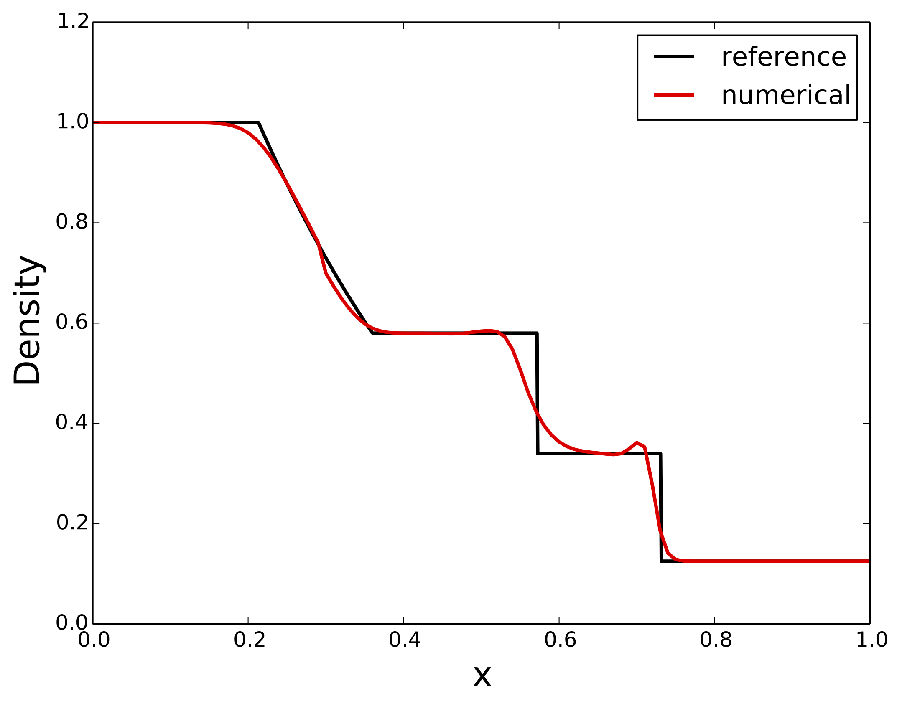
  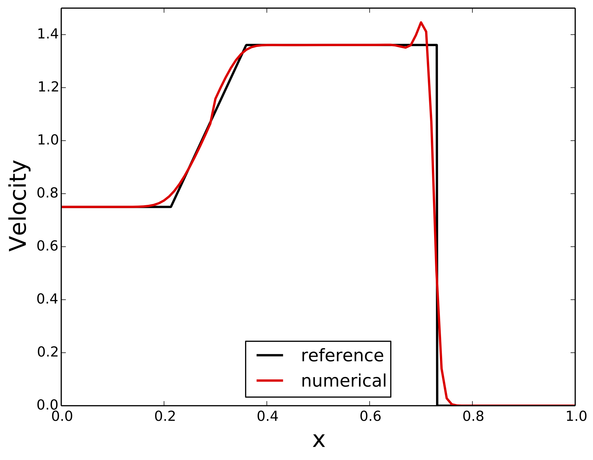 
  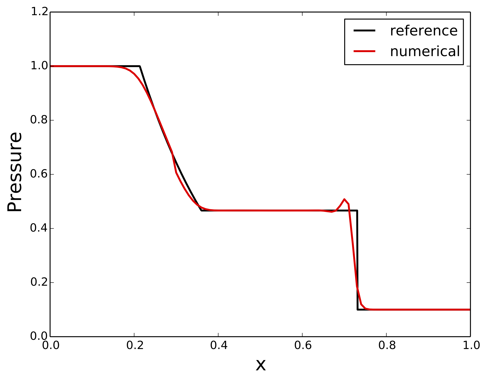

<figcaption>Fig. 2: Solution for the 1D shocktube problem</figcaption>
</figure>

 <a href="#TOC" >back to table of contents</a>  

### Isentropic vortex (examples/Euler/isentropic_vortex)

This test case describes the advection of an isentropic vortex. The speed and angle of advection can be respectively controlled by changing `M` and `alpha` in the `constants` section of `param.in`.

Once the solution files are generated, solution variables can plotted and saved using the `generate_plot.py` script

~~~sh
$ visit -cli -s line_extract SAMPLE_0 <variable>
~~~

where the `<variable>` name can be one of the following: `temperature`,`velx`,`vely`,`pressure` or any other variable listed in the `output` section of `param.in`. It is also possible to control the plot bounds using

~~~sh
$ visit -cli -s line_extract SAMPLE_0 <variable> <cmin> <cmax> <N>
~~~

where `<cmin>` and `<cmax>` are respectively the minumum and maximum pseudocolor/contour levels, while `<N>` is the number of contour lines.

<figure>

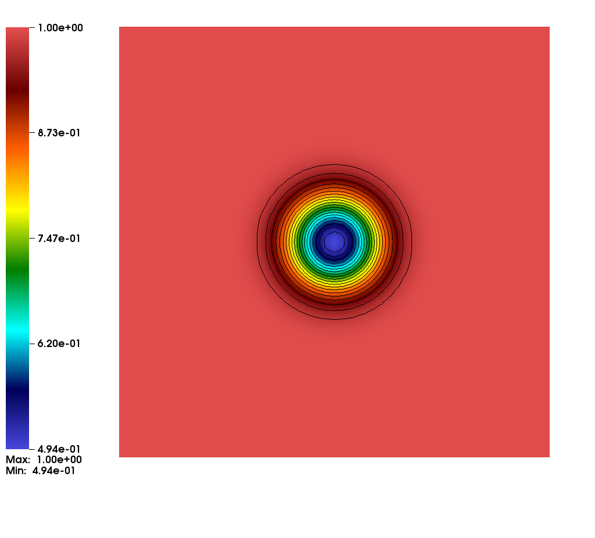
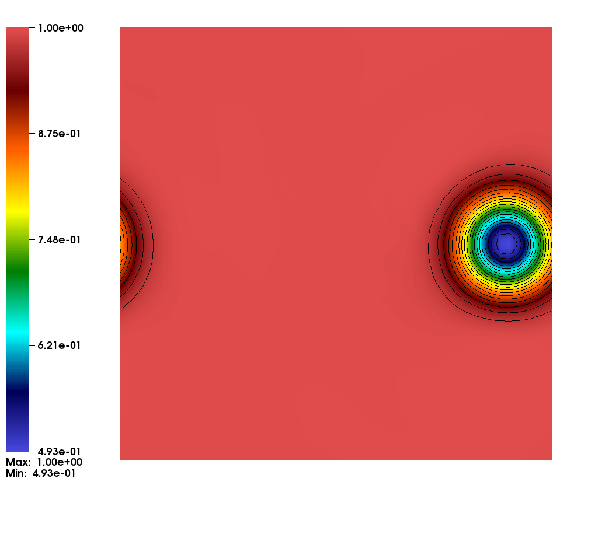
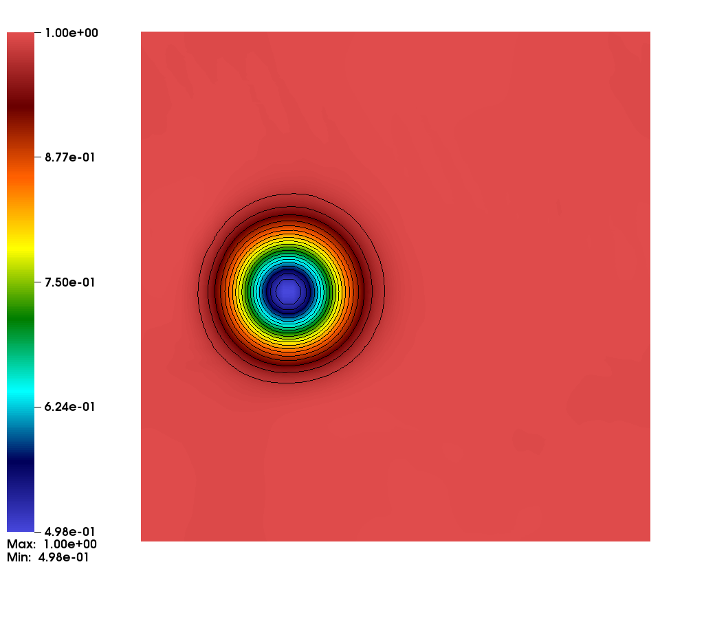

<figcaption>Fig. 3: Solution for the isentropic vortex at three different time instances</figcaption>
</figure>

 <a href="#TOC" >back to table of contents</a>  

### Inviscid transonic flow past a NACA-0012 airfoil (examples/Euler/naca)

This test case describes a **steady** transonic flow past a NACA-0012 airfoil, with Mach number 0.85 and an angle of attack of 1 degrees.

Once the solution files are generated, solution variables can plotted and saved using the `generate_plot.py` script as described for the [isentropic vortex](#isenvort).

The lift and drag coefficients due to pressure forces, and the Cp plots can be evaluated using

~~~sh
./plot_surface_data.py SAMPLE_0 <npart> <surf_tag_upper> <surf_tag_lower>
~~~

where `<npart>` is the number of mesh partitions created, while `<surf_tag_upper>` and `<surf_tag_lower>` are the physical tags associated with the upper and lower airfoil surface. respectively (these are also specified in the `output` section of `param.in`). For the default example, these tags are two surface tags: `<surf_tag_upper> = 2` and `<surf_tag_lower> = 3`.

The lift and drag coefficients are evaluated by reading the data from the file `force.dat`. The quanitites $$x,y,T,p,v_x,v_y,v_z$$ on the surface are saved in the partitioned files named as `v_0001_<part>_<surf_tag>.dat`, where $$T$$ us the temperature and `<part>` is the mesh partition id.

<figure>

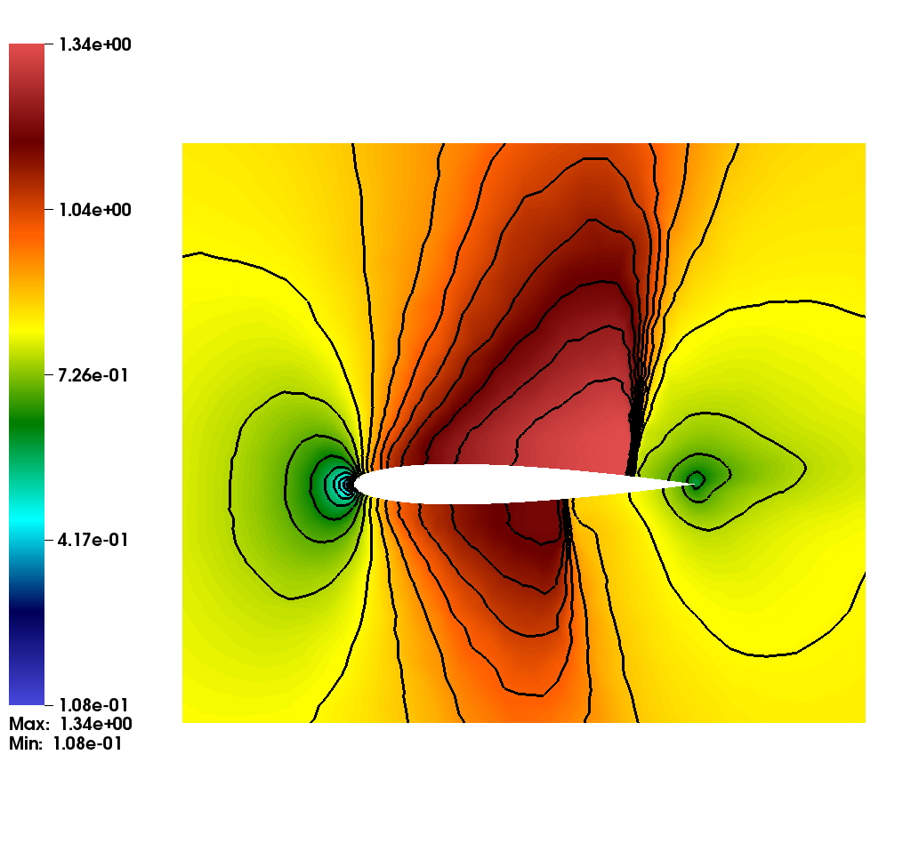
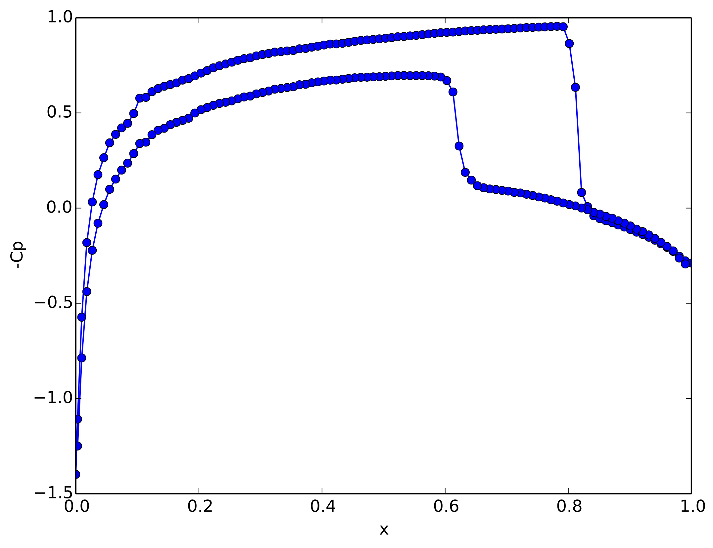

<figcaption>Fig. 4: Mach contour lines (left) and Cp plot (right) for flow past a NACA-0012 airfoil. Lift = 0.2914, Drag = 0.0734</figcaption>
</figure>

 <a href="#TOC" >back to table of contents</a>  

### Inviscid transonic flow past a RAE-2822 airfoil (examples/Euler/rae)

This test case describes a **steady** transonic flow past a RAE-2822 airfoil, with Mach number 0.729 and an angle of attack of 2.31 degrees.

As done for for the [NACA-0012 example](#inv_naca), the solution variables can be plotted using `generate_plot.py` in VisIt's cli environment. The lift, drag and Cp plots can be evaluated using `plot_surface_data.py` with `<surf_tag_upper> = 2` and `<surf_tag_lower> = 3`.

<figure>

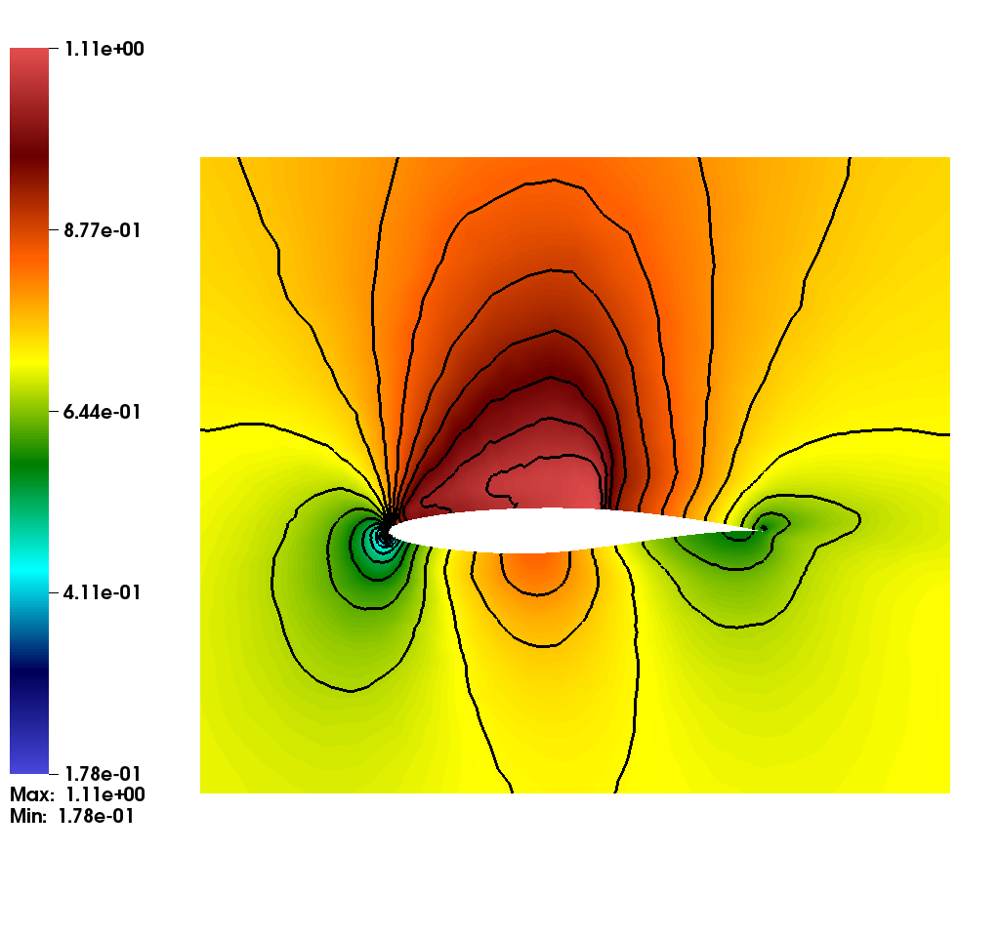
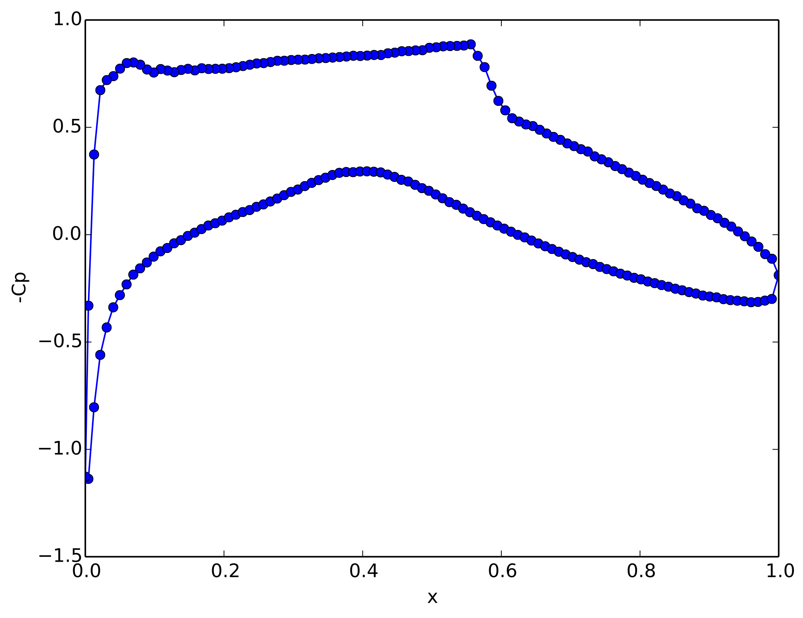

<figcaption>Fig. 5: Mach contour lines (left) and Cp plot (right) for flow past a RAE-2822 airfoil. Lift = 0.6041, Drag = 0.03195</figcaption>
</figure>

 <a href="#TOC" >back to table of contents</a>  

### Forward step in wind tunnel (examples/Euler/forward_step)

This test case is describes an inviscid supersonic flow past a step in a wind tunnel, which is impulsively started with an initial Mach number of $$M = 3$$.

As done for for the [NACA-0012 example](#inv_naca), the solution variables can be plotted using `generate_plot.py` in VisIt's cli environment.

<figure>

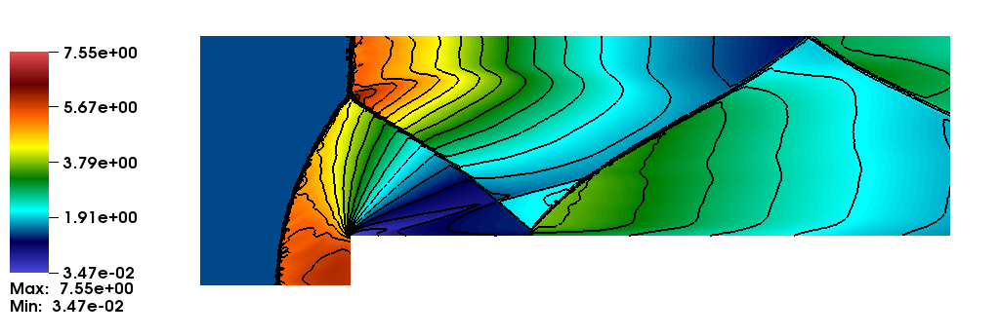

<figcaption>Fig. 6: Density plot for flow past a step.</figcaption>
</figure>

 <a href="#TOC" >back to table of contents</a>  

### Laminar flat-plate boundary layer (examples/NavierStokes/flat_plate)

This problem corresponds to a **steady** viscous flow over a flat plate which leads to the development of a boundary layer near the plate surface.The computational domain is taken as $$[0, 1.5] \times [0, 0.25]$$. There is an initial inlet portion of the domain of length 0.5 units on which slip boundary condition is imposed, followed by the no-slip boundary corresponding to the flat plate of length 1 unit. Adiabatic conditions are used on the flat plate boundary, with the Reynolds number corresponding to the plate length being $$10^5$$. The free-stream values used for the simulations are $$p_\infty = 8610$$, $$T_\infty = 300$$, $$v_{x,\infty} = 34.7189$$, $$v_{y,\infty} = 0$$, with the Prandtl number $$0.72$$ and gas constant $$R=287$$. The flow is initialized using the free-stream values, which has a Mach number of 0.1.

The approximated velocity profiles are compared with the Blasius semi-analytical solution in the standard non-dimensional units. These results are taken on the vertical line through the point on the plate, at a distance $$x=0.8$$ from the plate tip. The velocity profiles can be extracted using

~~~sh
visit -cli -s line_extract.py SAMPLE_0
~~~

which will save the data in the file `SAMPLE_0/line_data.dat`. The velocity profiles can be plotted and compared with the Blasius solution using

~~~sh
./plot_velocity_profile.py SAMPLE_0/line_data.dat
~~~

We show these plots in Figure 7, where $$Re_x$$ is the Reynolds number corresponding to the plate length at $$x=0.8$$, while $$\psi = y \sqrt{0.5 Re_x}/x$$ is the non-dimensionalized vertical distance from the plate at $$x=0.8$$. $$U_\infty$$ is the free-stream x-velocity.

<figure>

<figcaption>Fig. 7: Laminar flat plate boundary layer: (left) Stream-wise velocity, (right) Vertical velocity. </figcaption>
</figure>

 <a href="#TOC" >back to table of contents</a>  

### UQ with the shocktube problem (examples/UQ/shocktube)

Consider the [shocktube](#1dsod) problem described earlier. We demonstrate how one can introduced random perturbations to the initial conditions of the form

$$x_c \leftarrow x_c(1 + \delta(\omega_1 - 0.5)),\\
T_L \leftarrow T_L(1 + \delta(\omega_2 - 0.5)),\\
T_R \leftarrow T_R(1 + \delta(\omega_3 - 0.5)),\\
v_{x,L} \leftarrow v_{x,L}(1 + \delta(\omega_4 - 0.5)),\\
p_L \leftarrow p_L(1 + \delta(\omega_5 - 0.5)),\\
p_R \leftarrow p_R(1 + \delta(\omega_6 - 0.5))$$

where $$\omega_i$$ are chosen randomly from the interval $$[0,1]$$, while $$\delta$$ controls the amount of perturbation from the base states. The random numbers are pre-generated for a large number of samples, and saved in the file `urnd_nos.txt` (see description of `param.in` for details on the format). The default `urnd_nos.txt` file available for this example specifies 6 random numbers for sample IDs 0 to 1000. This is specified in `numeric` section of `param.in` in the following way:

~~~text
sample_list
{
  groups
  { 
   0 10
  }
  free_list
  {
  }   
}
rnd_file_loc    urnd_nos.txt
rnd_per_sample  6
~~~

Note that the sample IDs mentioned in the `sample_list` must be listed in `urnd_nos.txt`.

The random number are introduced using the function `pert(<type>,x,y,<k>`, where `<type>` sets the type of perturbation, `x,y` are the $$(x,y)$$ coordinated scaled to lie in $$[0,1]$$,  and `<k>` is an additional perturbation parameter. 

For the current problem, choose the perturbation function as `pert(4,0,0,k)`, which will simply pick the k-th random number available in `urand_nos.dat` for a given sample. The inital and boundary conditions are set as

~~~text
constants
{
   xc    0.3
   Tl    1.0 
   Tr    0.8
   ul    0.75
   ur    0.0
   pl    1.0
   pr    0.1
   dd    0.1
   
}
initial_condition
{
   temperature  (x < xc*(1+dd*(pert(4,0,0,1)-0.5)) )*Tl*(1+dd*(pert(4,0,0,2)-0.5)) + (x >= xc*(1+dd*(pert(4,0,0,1)-0.5)) )*Tr*(1+dd*(pert(4,0,0,3)-0.5))
   xvelocity    (x < xc*(1+dd*(pert(4,0,0,1)-0.5)) )*ul*(1+dd*(pert(4,0,0,4)-0.5)) + (x >= xc*(1+dd*(pert(4,0,0,1)-0.5)) )*ur
   yvelocity    0.0
   zvelocity    0.0
   pressure     (x < xc*(1+dd*(pert(4,0,0,1)-0.5)) )*pl*(1+dd*(pert(4,0,0,5)-0.5)) + (x >= xc*(1+dd*(pert(4,0,0,1)-0.5)) )*pr*(1+dd*(pert(4,0,0,6)-0.5))
}
boundary
{
   100001 // inlet boundary
   {
      type         inlet
      temperature  (x < xc*(1+dd*(pert(4,0,0,1)-0.5)) )*Tl*(1+dd*(pert(4,0,0,2)-0.5)) + (x >= xc*(1+dd*(pert(4,0,0,1)-0.5)) )*Tr*(1+dd*(pert(4,0,0,3)-0.5))
	  xvelocity    (x < xc*(1+dd*(pert(4,0,0,1)-0.5)) )*ul*(1+dd*(pert(4,0,0,4)-0.5)) + (x >= xc*(1+dd*(pert(4,0,0,1)-0.5)) )*ur
	  yvelocity    0.0
	  zvelocity    0.0
	  pressure     (x < xc*(1+dd*(pert(4,0,0,1)-0.5)) )*pl*(1+dd*(pert(4,0,0,5)-0.5)) + (x >= xc*(1+dd*(pert(4,0,0,1)-0.5)) )*pr*(1+dd*(pert(4,0,0,6)-0.5))
   }
   100002 // outlet boundary
   {
      type       outlet
   }

   100003
   100004
   {
      type        periodic
   }
}
~~~

Once the solution for all the samples IDs have been generated, the data along the line $$y=0.02$$ can be extracted using

~~~sh
$ visit -cli -s line_extract <sample_start> <sample_end>
~~~

for all samples with IDs `<sample_start>` to `<sample_end>`. The various sample solutions and the pointwise statistics can be plotted using

~~~sh
./plot_soln.py <sample_start> <sample_end> <t_instance>
~~~

where `<t_instance>` can be set as an integer value between 0 and `time_stamps` (see `output` section of `param.in`).

<figure>

  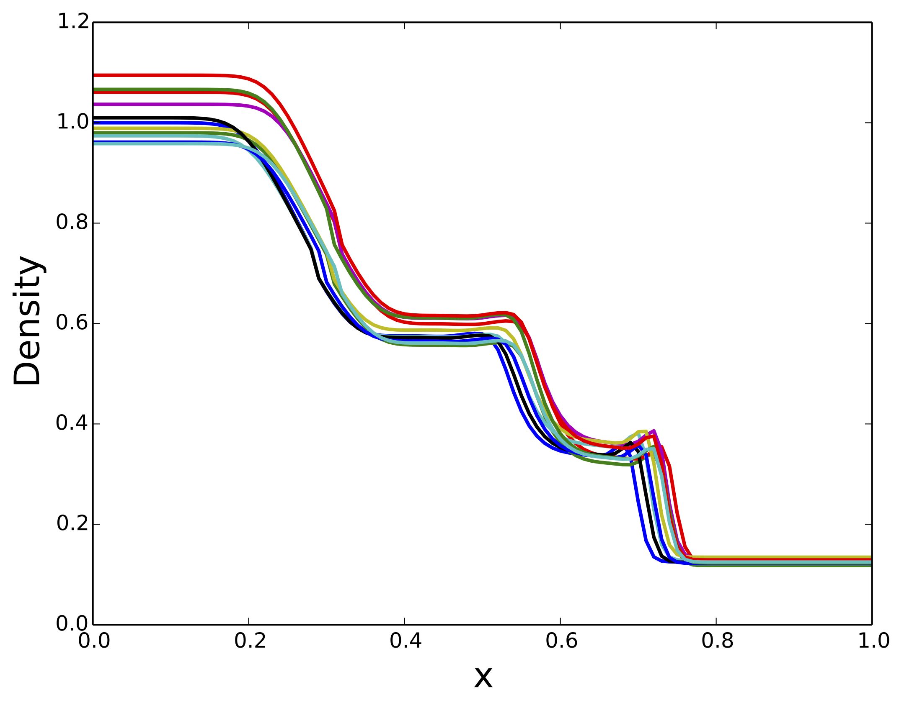
  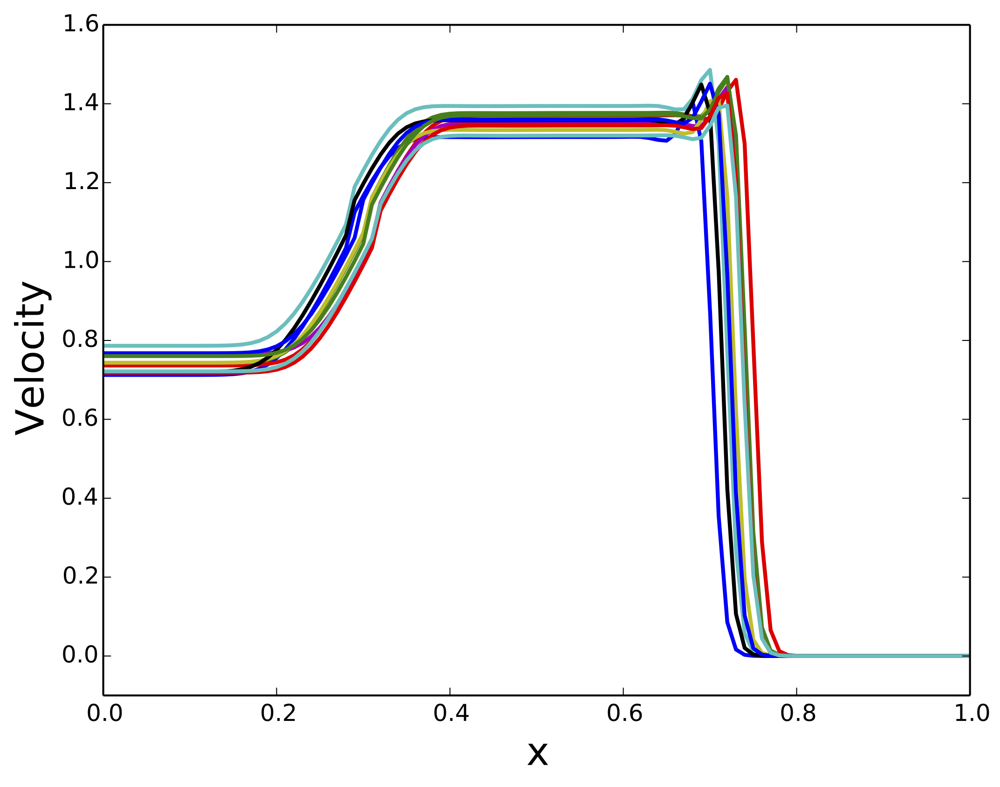 
  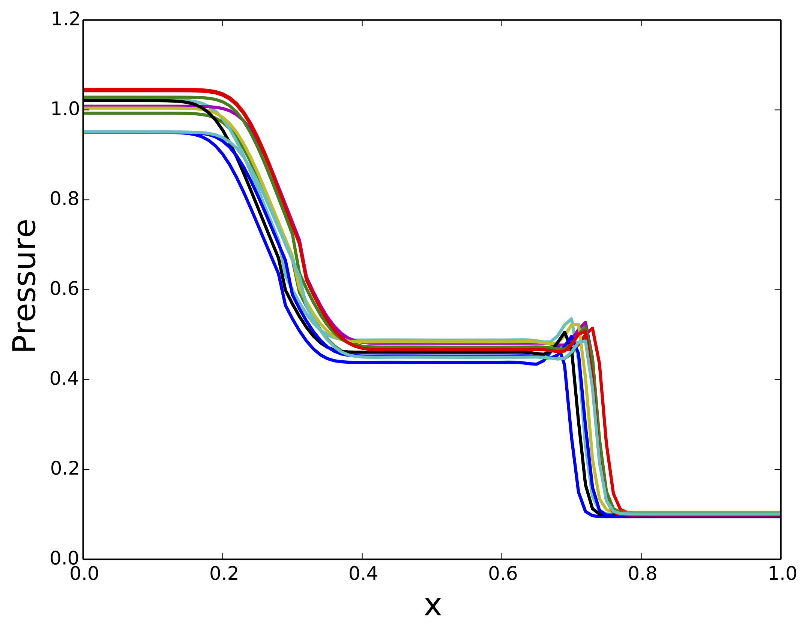

<figcaption>Fig. 8: All samples for 1D shocktube problem</figcaption>
</figure>

<figure>

  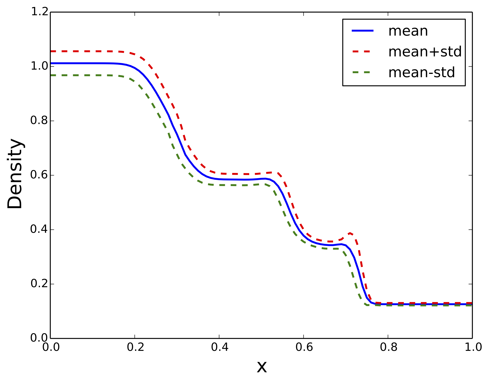
  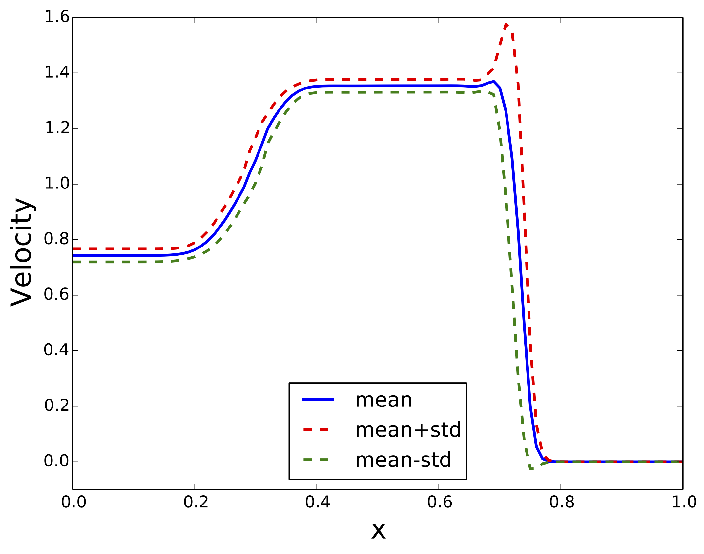 
  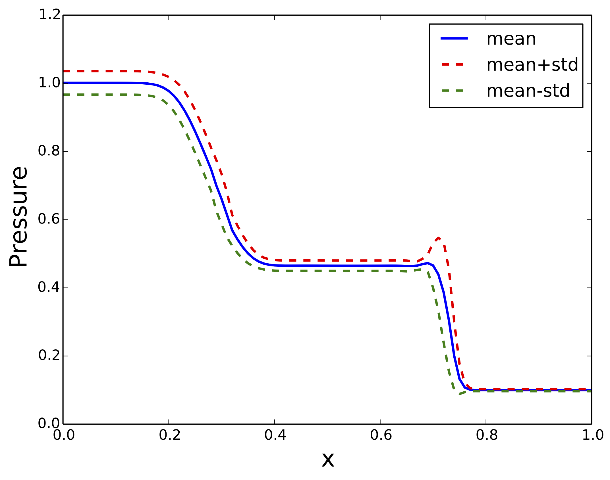

<figcaption>Fig. 9: Statistics for 1D shocktube problem</figcaption>
</figure>

 <a href="#TOC" >back to table of contents</a>  

### Other available examples

* Supersonic (steady) flow over a wedge (examples/Euler/supersonic_wedge)
* Supersonic (steady) flow past a cylinder at Mach 2 and 10 (examples/Euler/supersonic_semicylinder)
* Subsonic (steady) isentropic flow past a cylinder at Mach 0.3 and 10 (examples/Euler/subsonic_fullcylinder)

 <a href="#TOC" >back to table of contents</a>  

